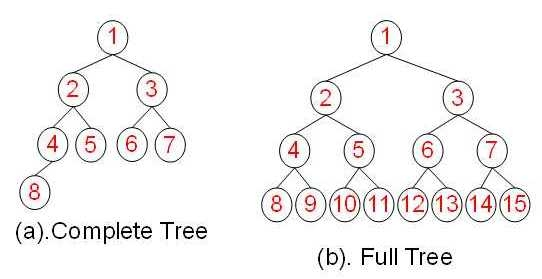

# 二叉树 (Binary Tree)

> 二叉树是一个连通的无环图，并且每个节点的度不大于3.

## 满二叉树（Full Binary Tree）

> 一棵深度为k, 且有 $$  2^k - 1 $$ 个节点的二叉树

`特点`
每一层上的节点数都是最大节点数。

## 完全二叉树（Complete Binary Tree）

> 一棵二叉树，除了最后一层外，其余层都是满，并且最后一层或者是满的，
> 或者是在右边缺少连续若干节点

- 具有 n 个节点的`完全二叉树`的深度为  $$  \log_2{n} + 1 $$
- 深度为k额`完全二叉树`，至少有 $$ 2^{k - 1} $$ 个节点，至多有 $$  2^k - 1 $$ 个节点

 || 完全二叉树 | 满二叉树 |
| -- | -- | -- |
| 总节点k |  $$ 2^{h - 1} $$ <= k <= $$ 2^h - 1 $$  |  k = $$ 2^h - 1 $$ |
| 树高h  | h = $$ \log_2{k} + 1 $$  |  h = $$ \log_2{k + 1} $$ |
